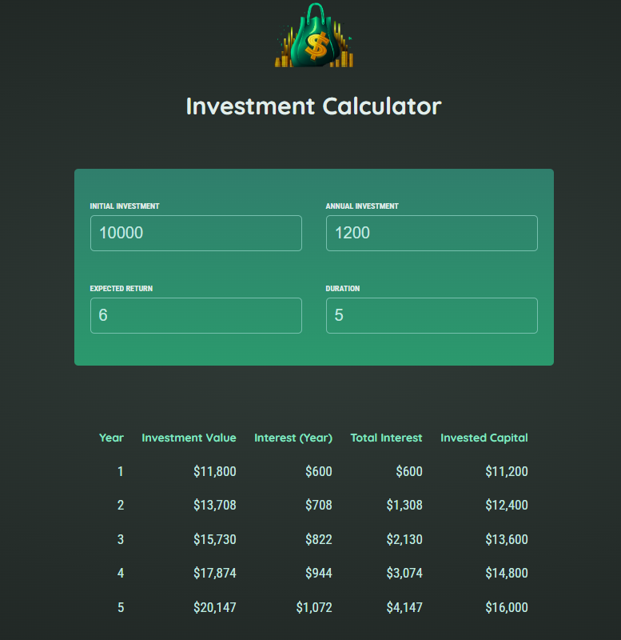

# Investment Calculator React - Daniela Serrano

Investment calculator made in React. The user can add/change the initial investment, duration, Annual investment and expected return (years) and the app will calculate the interest per year, total interest and Invested capital, showing the results in a table. I built it as a result of the React course by Maximilian Schwarzmüller (Udemy).

## Table of contents

- [Overview](#overview)
  - [The exercise](#the-exercise)
  - [Screenshot](#screenshot)
  - [Links](#links)
- [My process](#my-process)
  - [Built with](#built-with)
- [Author](#author)

## Overview

### The exercise

Users should be able to:

- Add/change the initial investment, duration, Annual investment and expected return (years).
- Get the interest per year, total interest and Invested capital.

### Screenshot

### Links

- Live Site URL: [Investment Calculator React](https://investment-calculator-react-ds.netlify.app/)

## My process

### Built with

- React
- CSS custom properties
- JSX files

## Author

- Website - [Daniela Serrano](https://danielaser.github.io/)
- Github - [@danielaser](https://github.com/danielaser)
